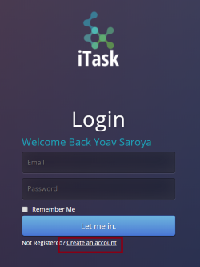
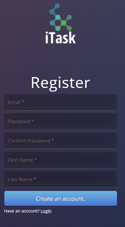
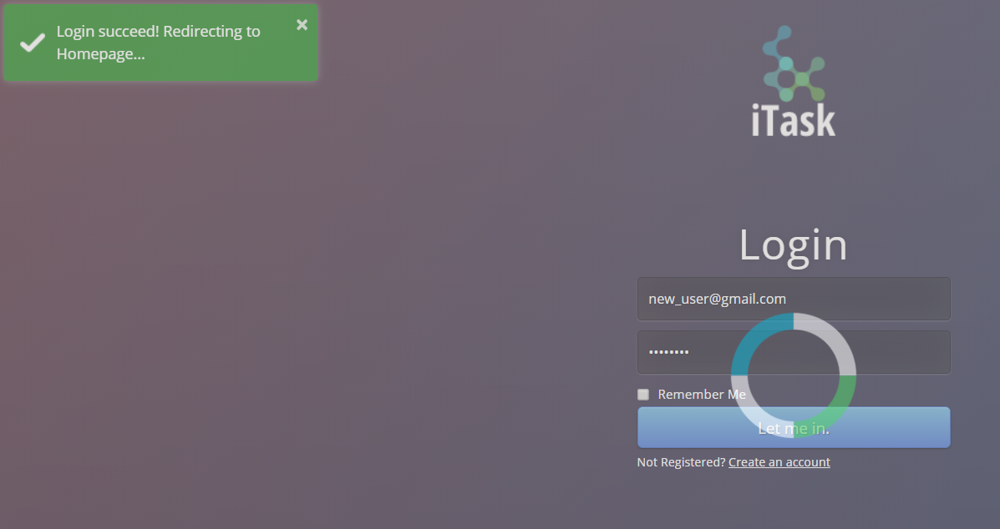
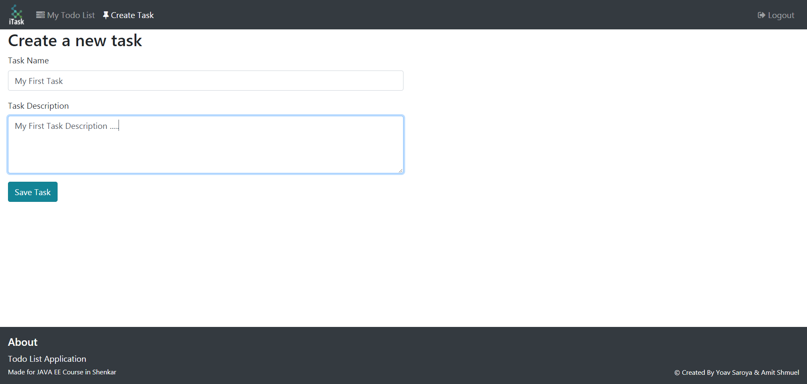
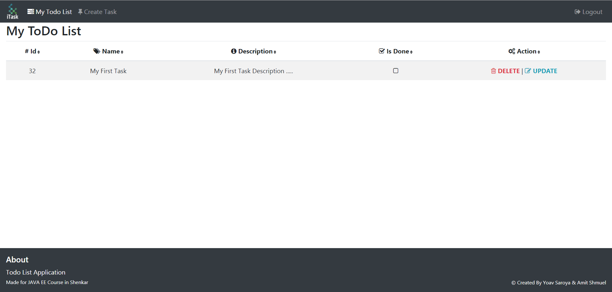
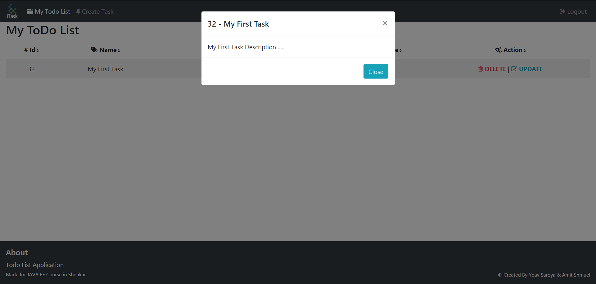

## ToDo List Web Application For JAVA EE Course (Shenkar, 2018)

### Info
This project is made for course JAVA EE Course in Shenkar, by Yoav Saroya & Amit Shmuel.

### How-To:
* First, Click here to register !  

* Now fill this short form, and finally click on **'Create an account'**  

* Now Insert your email & password and click on **'Let me in'**. You will redirect to home page  

* In home page, click on 'Create Task' tab, and Create your first Task, Finally click **'Save Task'**  

* Finally, you will see your ToDo list. you can of course Delete, Update, and mark it as Done (in checkbox)  

* You can view full details of your task by clicking on it  

#### Credits:
- [ToastR](https://github.com/CodeSeven/toastr)
- [TableSorter jQuery plugin](http://tablesorter.com/docs/)

###### Made By Yoav Saroya & Amit Shmuel